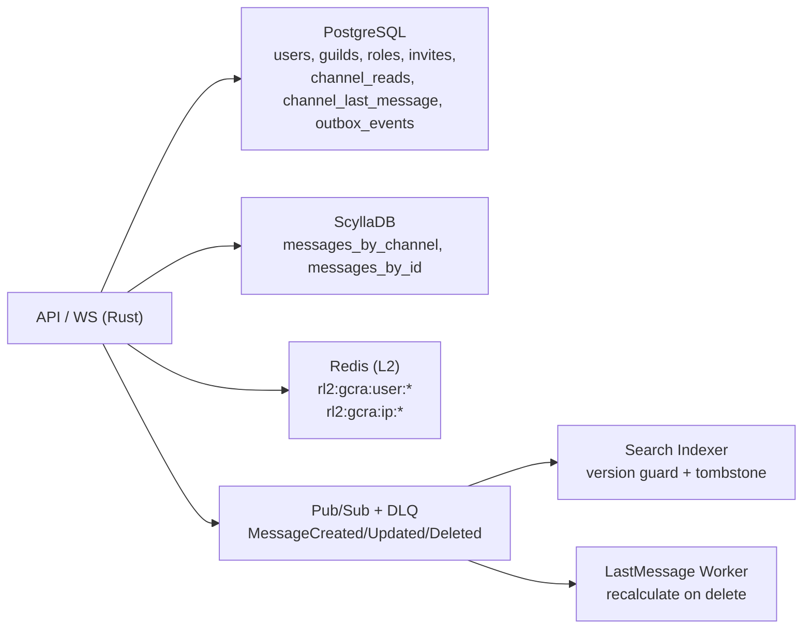
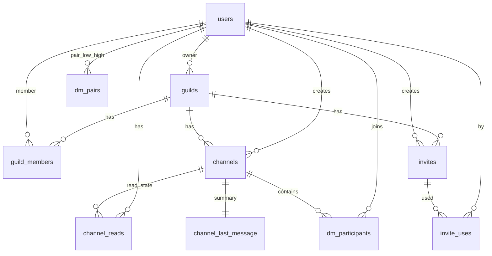

# LIN-131 Distributed DB Overview

`SaaS dev all` 全体像ページへ転記できる要約図。

## Storage Responsibility

## ER (PostgreSQL core)

## Runtime Contracts

- `channel_reads` は単調増加upsert（逆行禁止）
- outbox は `PENDING/FAILED` を再取得し再送
- Search は `version` 原子ガードで順不同イベントを処理
- `MessageDeleted` は `is_deleted=true` tombstone 更新
- `channel_last_message` は削除時のみ再計算
- RateLimit は L1主経路 + Redis L2フォールバック
