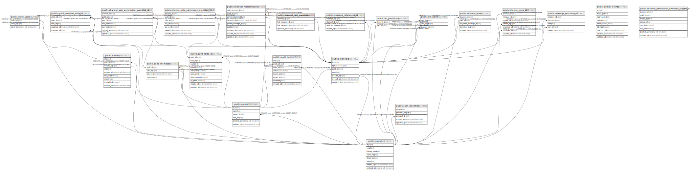

# linklynx

## Tables

| Name | Columns | Comment | Type |
| ---- | ------- | ------- | ---- |
| [public.users](public.users.md) | 8 |  | BASE TABLE |
| [public.guilds](public.guilds.md) | 6 |  | BASE TABLE |
| [public.guild_members](public.guild_members.md) | 4 |  | BASE TABLE |
| [public.invites](public.invites.md) | 9 |  | BASE TABLE |
| [public.invite_uses](public.invite_uses.md) | 3 |  | BASE TABLE |
| [public.channels](public.channels.md) | 7 |  | BASE TABLE |
| [public.dm_participants](public.dm_participants.md) | 2 |  | BASE TABLE |
| [public.dm_pairs](public.dm_pairs.md) | 3 |  | BASE TABLE |
| [public.channel_reads](public.channel_reads.md) | 5 |  | BASE TABLE |
| [public.channel_last_message](public.channel_last_message.md) | 4 |  | BASE TABLE |
| [public.audit_logs](public.audit_logs.md) | 8 |  | BASE TABLE |
| [public.outbox_events](public.outbox_events.md) | 9 |  | BASE TABLE |
| [public.auth_identities](public.auth_identities.md) | 5 |  | BASE TABLE |
| [public.guild_roles_v2](public.guild_roles_v2.md) | 10 |  | BASE TABLE |
| [public.guild_member_roles_v2](public.guild_member_roles_v2.md) | 5 |  | BASE TABLE |
| [public.channel_role_permission_overrides_v2](public.channel_role_permission_overrides_v2.md) | 7 |  | BASE TABLE |
| [public.channel_user_permission_overrides_v2](public.channel_user_permission_overrides_v2.md) | 7 |  | BASE TABLE |
| [public.channel_permission_overrides_subject_v2](public.channel_permission_overrides_subject_v2.md) | 8 |  | VIEW |
| [public.channel_hierarchies_v2](public.channel_hierarchies_v2.md) | 9 |  | BASE TABLE |
| [public.message_references_v2](public.message_references_v2.md) | 4 |  | BASE TABLE |
| [public.channel_pins_v2](public.channel_pins_v2.md) | 7 |  | BASE TABLE |

## Stored procedures and functions

| Name | ReturnType | Arguments | Type |
| ---- | ------- | ------- | ---- |
| public.set_users_updated_at | trigger |  | FUNCTION |
| public.enforce_dm_pairs_channel_type | trigger |  | FUNCTION |
| public.upsert_channel_reads_monotonic | void | p_channel_id bigint, p_user_id bigint, p_last_read_message_id bigint, p_last_client_seq bigint | FUNCTION |
| public.claim_outbox_events | record | p_limit integer DEFAULT 50, p_lease_seconds integer DEFAULT 30 | FUNCTION |
| public.mark_outbox_event_sent | void | p_id bigint | FUNCTION |
| public.mark_outbox_event_failed | void | p_id bigint, p_retry_seconds integer DEFAULT 15 | FUNCTION |
| public.enforce_channel_role_overrides_v2_scope | trigger |  | FUNCTION |
| public.enforce_channel_user_overrides_v2_scope | trigger |  | FUNCTION |
| public.enforce_channel_hierarchies_v2_scope | trigger |  | FUNCTION |

## Enums

| Name | Values |
| ---- | ------- |
| public.audit_action | CHANNEL_CREATE, CHANNEL_DELETE, CHANNEL_UPDATE, GUILD_MEMBER_JOIN, GUILD_MEMBER_LEAVE, INVITE_CREATE, INVITE_DISABLE, MESSAGE_DELETE_MOD, ROLE_ASSIGN, ROLE_REVOKE, USER_BAN, USER_UNBAN |
| public.channel_hierarchy_kind | category_child, thread |
| public.channel_type | dm, guild_text |
| public.outbox_status | FAILED, PENDING, SENT |

## Relations

---

> Generated by [tbls](https://github.com/k1LoW/tbls)
