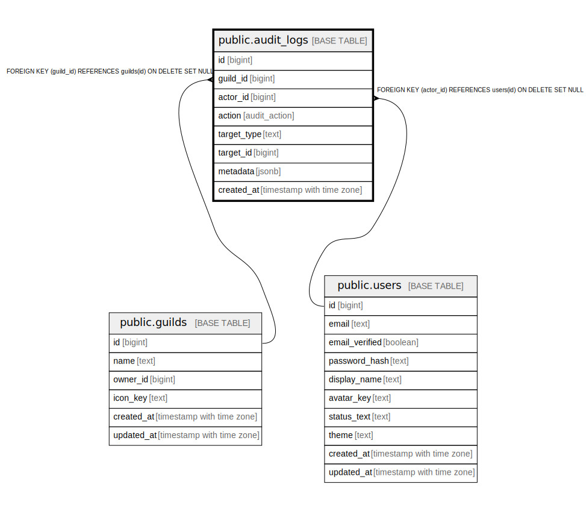

# public.audit_logs

## Description

## Columns

| Name | Type | Default | Nullable | Children | Parents | Comment |
| ---- | ---- | ------- | -------- | -------- | ------- | ------- |
| id | bigint |  | false |  |  |  |
| guild_id | bigint |  | true |  | [public.guilds](public.guilds.md) |  |
| actor_id | bigint |  | true |  | [public.users](public.users.md) |  |
| action | audit_action |  | false |  |  |  |
| target_type | text |  | true |  |  |  |
| target_id | bigint |  | true |  |  |  |
| metadata | jsonb | '{}'::jsonb | false |  |  |  |
| created_at | timestamp with time zone | now() | false |  |  |  |

## Constraints

| Name | Type | Definition |
| ---- | ---- | ---------- |
| audit_logs_actor_id_fkey | FOREIGN KEY | FOREIGN KEY (actor_id) REFERENCES users(id) ON DELETE SET NULL |
| audit_logs_guild_id_fkey | FOREIGN KEY | FOREIGN KEY (guild_id) REFERENCES guilds(id) ON DELETE SET NULL |
| audit_logs_pkey | PRIMARY KEY | PRIMARY KEY (id) |

## Indexes

| Name | Definition |
| ---- | ---------- |
| audit_logs_pkey | CREATE UNIQUE INDEX audit_logs_pkey ON public.audit_logs USING btree (id) |
| idx_audit_guild_time | CREATE INDEX idx_audit_guild_time ON public.audit_logs USING btree (guild_id, created_at DESC) WHERE (guild_id IS NOT NULL) |

## Relations

---

> Generated by [tbls](https://github.com/k1LoW/tbls)
