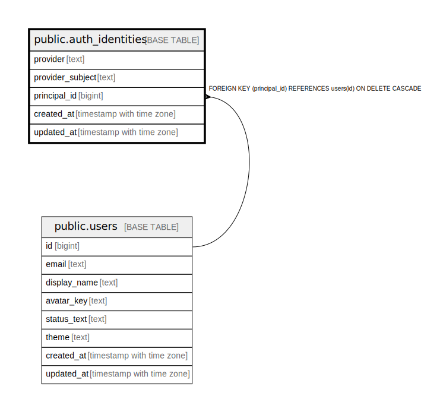

# public.auth_identities

## Description

## Columns

| Name | Type | Default | Nullable | Children | Parents | Comment |
| ---- | ---- | ------- | -------- | -------- | ------- | ------- |
| provider | text |  | false |  |  |  |
| provider_subject | text |  | false |  |  |  |
| principal_id | bigint |  | false |  | [public.users](public.users.md) |  |
| created_at | timestamp with time zone | now() | false |  |  |  |
| updated_at | timestamp with time zone | now() | false |  |  |  |

## Constraints

| Name | Type | Definition |
| ---- | ---- | ---------- |
| chk_auth_identities_provider_non_empty | CHECK | CHECK ((length(provider) > 0)) |
| chk_auth_identities_provider_subject_non_empty | CHECK | CHECK ((length(provider_subject) > 0)) |
| auth_identities_principal_id_fkey | FOREIGN KEY | FOREIGN KEY (principal_id) REFERENCES users(id) ON DELETE CASCADE |
| auth_identities_pkey | PRIMARY KEY | PRIMARY KEY (provider, provider_subject) |
| uq_auth_identities_provider_principal | UNIQUE | UNIQUE (provider, principal_id) |

## Indexes

| Name | Definition |
| ---- | ---------- |
| auth_identities_pkey | CREATE UNIQUE INDEX auth_identities_pkey ON public.auth_identities USING btree (provider, provider_subject) |
| uq_auth_identities_provider_principal | CREATE UNIQUE INDEX uq_auth_identities_provider_principal ON public.auth_identities USING btree (provider, principal_id) |
| idx_auth_identities_principal_id | CREATE INDEX idx_auth_identities_principal_id ON public.auth_identities USING btree (principal_id) |

## Relations

---

> Generated by [tbls](https://github.com/k1LoW/tbls)
