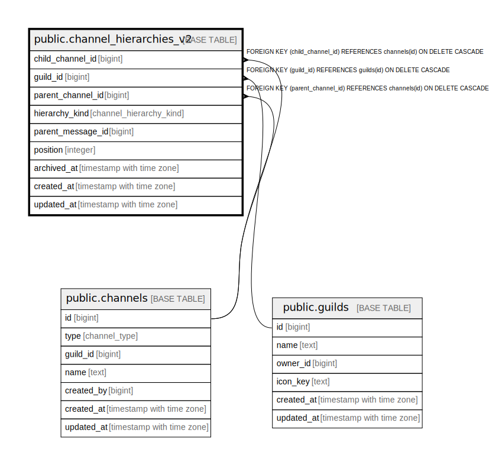

# public.channel_hierarchies_v2

## Description

## Columns

| Name | Type | Default | Nullable | Children | Parents | Comment |
| ---- | ---- | ------- | -------- | -------- | ------- | ------- |
| child_channel_id | bigint |  | false |  | [public.channels](public.channels.md) |  |
| guild_id | bigint |  | false |  | [public.guilds](public.guilds.md) |  |
| parent_channel_id | bigint |  | false |  | [public.channels](public.channels.md) |  |
| hierarchy_kind | channel_hierarchy_kind |  | false |  |  |  |
| parent_message_id | bigint |  | true |  |  |  |
| position | integer | 0 | false |  |  |  |
| archived_at | timestamp with time zone |  | true |  |  |  |
| created_at | timestamp with time zone | now() | false |  |  |  |
| updated_at | timestamp with time zone | now() | false |  |  |  |

## Constraints

| Name | Type | Definition |
| ---- | ---- | ---------- |
| chk_ch_hier_v2_thread_parent_msg | CHECK | CHECK ((((hierarchy_kind = 'thread'::channel_hierarchy_kind) AND (parent_message_id IS NOT NULL)) OR ((hierarchy_kind = 'category_child'::channel_hierarchy_kind) AND (parent_message_id IS NULL)))) |
| chk_channel_hierarchies_v2_not_self | CHECK | CHECK ((child_channel_id <> parent_channel_id)) |
| chk_channel_hierarchies_v2_position_non_negative | CHECK | CHECK (("position" >= 0)) |
| channel_hierarchies_v2_guild_id_fkey | FOREIGN KEY | FOREIGN KEY (guild_id) REFERENCES guilds(id) ON DELETE CASCADE |
| channel_hierarchies_v2_child_channel_id_fkey | FOREIGN KEY | FOREIGN KEY (child_channel_id) REFERENCES channels(id) ON DELETE CASCADE |
| channel_hierarchies_v2_parent_channel_id_fkey | FOREIGN KEY | FOREIGN KEY (parent_channel_id) REFERENCES channels(id) ON DELETE CASCADE |
| channel_hierarchies_v2_pkey | PRIMARY KEY | PRIMARY KEY (child_channel_id) |

## Indexes

| Name | Definition |
| ---- | ---------- |
| channel_hierarchies_v2_pkey | CREATE UNIQUE INDEX channel_hierarchies_v2_pkey ON public.channel_hierarchies_v2 USING btree (child_channel_id) |
| idx_channel_hierarchies_v2_parent_pos | CREATE INDEX idx_channel_hierarchies_v2_parent_pos ON public.channel_hierarchies_v2 USING btree (parent_channel_id, "position", child_channel_id) |
| idx_channel_hierarchies_v2_guild_kind | CREATE INDEX idx_channel_hierarchies_v2_guild_kind ON public.channel_hierarchies_v2 USING btree (guild_id, hierarchy_kind, parent_channel_id) |
| uq_channel_hierarchies_v2_thread_parent_message | CREATE UNIQUE INDEX uq_channel_hierarchies_v2_thread_parent_message ON public.channel_hierarchies_v2 USING btree (guild_id, parent_channel_id, parent_message_id) WHERE (hierarchy_kind = 'thread'::channel_hierarchy_kind) |

## Triggers

| Name | Definition |
| ---- | ---------- |
| trg_enforce_channel_hierarchies_v2_scope | CREATE TRIGGER trg_enforce_channel_hierarchies_v2_scope BEFORE INSERT OR UPDATE ON public.channel_hierarchies_v2 FOR EACH ROW EXECUTE FUNCTION enforce_channel_hierarchies_v2_scope() |

## Relations

---

> Generated by [tbls](https://github.com/k1LoW/tbls)
