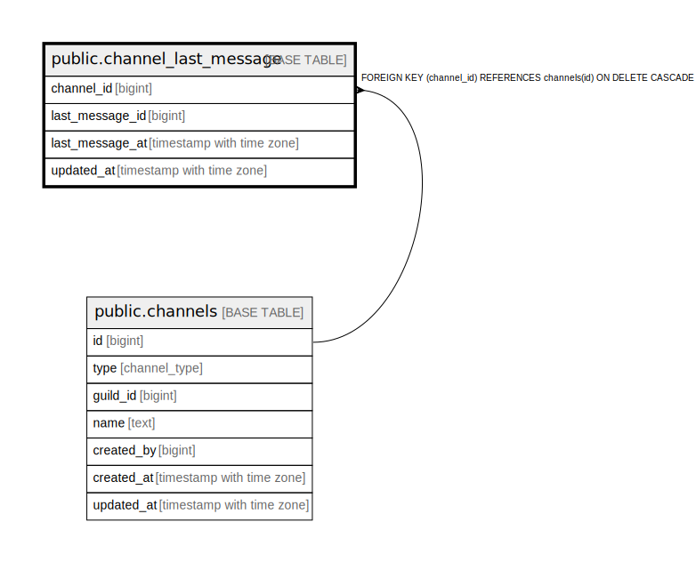

# public.channel_last_message

## Description

## Columns

| Name | Type | Default | Nullable | Children | Parents | Comment |
| ---- | ---- | ------- | -------- | -------- | ------- | ------- |
| channel_id | bigint |  | false |  | [public.channels](public.channels.md) |  |
| last_message_id | bigint |  | false |  |  |  |
| last_message_at | timestamp with time zone |  | false |  |  |  |
| updated_at | timestamp with time zone | now() | false |  |  |  |

## Constraints

| Name | Type | Definition |
| ---- | ---- | ---------- |
| channel_last_message_channel_id_fkey | FOREIGN KEY | FOREIGN KEY (channel_id) REFERENCES channels(id) ON DELETE CASCADE |
| channel_last_message_pkey | PRIMARY KEY | PRIMARY KEY (channel_id) |

## Indexes

| Name | Definition |
| ---- | ---------- |
| channel_last_message_pkey | CREATE UNIQUE INDEX channel_last_message_pkey ON public.channel_last_message USING btree (channel_id) |
| idx_channel_last_message_time | CREATE INDEX idx_channel_last_message_time ON public.channel_last_message USING btree (last_message_at DESC) |

## Relations

---

> Generated by [tbls](https://github.com/k1LoW/tbls)
