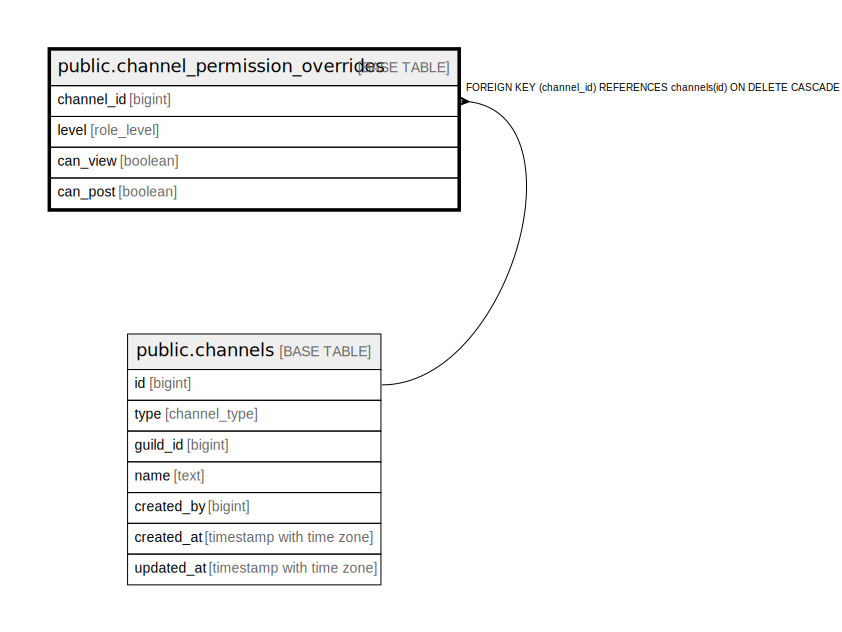

# public.channel_permission_overrides

## Description

## Columns

| Name | Type | Default | Nullable | Children | Parents | Comment |
| ---- | ---- | ------- | -------- | -------- | ------- | ------- |
| channel_id | bigint |  | false |  | [public.channels](public.channels.md) |  |
| level | role_level |  | false |  |  |  |
| can_view | boolean |  | true |  |  | NULL はロール既定値を継承、TRUE/FALSE は明示上書き。 |
| can_post | boolean |  | true |  |  | NULL はロール既定値を継承、TRUE/FALSE は明示上書き。 |

## Constraints

| Name | Type | Definition |
| ---- | ---- | ---------- |
| channel_permission_overrides_channel_id_fkey | FOREIGN KEY | FOREIGN KEY (channel_id) REFERENCES channels(id) ON DELETE CASCADE |
| channel_permission_overrides_pkey | PRIMARY KEY | PRIMARY KEY (channel_id, level) |

## Indexes

| Name | Definition |
| ---- | ---------- |
| channel_permission_overrides_pkey | CREATE UNIQUE INDEX channel_permission_overrides_pkey ON public.channel_permission_overrides USING btree (channel_id, level) |

## Relations

---

> Generated by [tbls](https://github.com/k1LoW/tbls)
