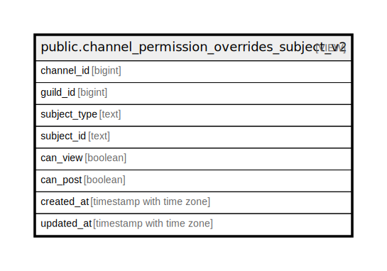

# public.channel_permission_overrides_subject_v2

## Description

<details>
<summary><strong>Table Definition</strong></summary>

```sql
CREATE VIEW channel_permission_overrides_subject_v2 AS (
 SELECT channel_role_permission_overrides_v2.channel_id,
    channel_role_permission_overrides_v2.guild_id,
    'role'::text AS subject_type,
    channel_role_permission_overrides_v2.role_key AS subject_id,
    channel_role_permission_overrides_v2.can_view,
    channel_role_permission_overrides_v2.can_post,
    channel_role_permission_overrides_v2.created_at,
    channel_role_permission_overrides_v2.updated_at
   FROM channel_role_permission_overrides_v2
UNION ALL
 SELECT channel_user_permission_overrides_v2.channel_id,
    channel_user_permission_overrides_v2.guild_id,
    'user'::text AS subject_type,
    (channel_user_permission_overrides_v2.user_id)::text AS subject_id,
    channel_user_permission_overrides_v2.can_view,
    channel_user_permission_overrides_v2.can_post,
    channel_user_permission_overrides_v2.created_at,
    channel_user_permission_overrides_v2.updated_at
   FROM channel_user_permission_overrides_v2
)
```

</details>

## Columns

| Name | Type | Default | Nullable | Children | Parents | Comment |
| ---- | ---- | ------- | -------- | -------- | ------- | ------- |
| channel_id | bigint |  | true |  |  |  |
| guild_id | bigint |  | true |  |  |  |
| subject_type | text |  | true |  |  |  |
| subject_id | text |  | true |  |  |  |
| can_view | boolean |  | true |  |  |  |
| can_post | boolean |  | true |  |  |  |
| created_at | timestamp with time zone |  | true |  |  |  |
| updated_at | timestamp with time zone |  | true |  |  |  |

## Referenced Tables

| Name | Columns | Comment | Type |
| ---- | ------- | ------- | ---- |
| [public.channel_role_permission_overrides_v2](public.channel_role_permission_overrides_v2.md) | 7 |  | BASE TABLE |
| [public.channel_user_permission_overrides_v2](public.channel_user_permission_overrides_v2.md) | 7 |  | BASE TABLE |

## Relations



---

> Generated by [tbls](https://github.com/k1LoW/tbls)
