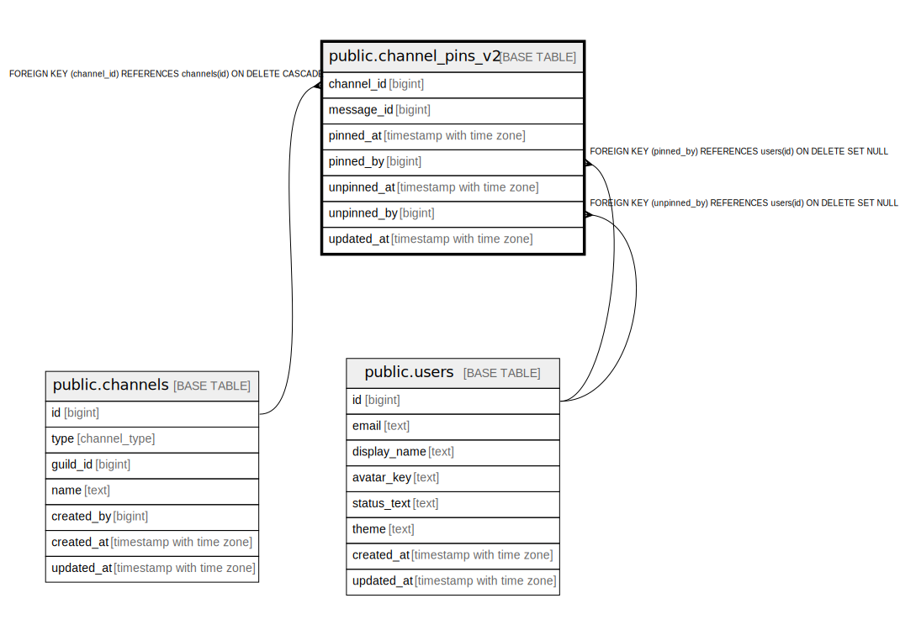

# public.channel_pins_v2

## Description

## Columns

| Name | Type | Default | Nullable | Children | Parents | Comment |
| ---- | ---- | ------- | -------- | -------- | ------- | ------- |
| channel_id | bigint |  | false |  | [public.channels](public.channels.md) |  |
| message_id | bigint |  | false |  |  |  |
| pinned_at | timestamp with time zone | now() | false |  |  |  |
| pinned_by | bigint |  | true |  | [public.users](public.users.md) |  |
| unpinned_at | timestamp with time zone |  | true |  |  |  |
| unpinned_by | bigint |  | true |  | [public.users](public.users.md) |  |
| updated_at | timestamp with time zone | now() | false |  |  |  |

## Constraints

| Name | Type | Definition |
| ---- | ---- | ---------- |
| chk_ch_pins_v2_unpin_pair | CHECK | CHECK ((((unpinned_at IS NULL) AND (unpinned_by IS NULL)) OR (unpinned_at IS NOT NULL))) |
| chk_ch_pins_v2_unpin_time | CHECK | CHECK (((unpinned_at IS NULL) OR (unpinned_at >= pinned_at))) |
| channel_pins_v2_pinned_by_fkey | FOREIGN KEY | FOREIGN KEY (pinned_by) REFERENCES users(id) ON DELETE SET NULL |
| channel_pins_v2_unpinned_by_fkey | FOREIGN KEY | FOREIGN KEY (unpinned_by) REFERENCES users(id) ON DELETE SET NULL |
| channel_pins_v2_channel_id_fkey | FOREIGN KEY | FOREIGN KEY (channel_id) REFERENCES channels(id) ON DELETE CASCADE |
| channel_pins_v2_pkey | PRIMARY KEY | PRIMARY KEY (channel_id, message_id) |

## Indexes

| Name | Definition |
| ---- | ---------- |
| channel_pins_v2_pkey | CREATE UNIQUE INDEX channel_pins_v2_pkey ON public.channel_pins_v2 USING btree (channel_id, message_id) |
| idx_ch_pins_v2_active | CREATE INDEX idx_ch_pins_v2_active ON public.channel_pins_v2 USING btree (channel_id, pinned_at DESC, message_id DESC) WHERE (unpinned_at IS NULL) |
| idx_ch_pins_v2_message | CREATE INDEX idx_ch_pins_v2_message ON public.channel_pins_v2 USING btree (message_id) |

## Relations

---

> Generated by [tbls](https://github.com/k1LoW/tbls)
