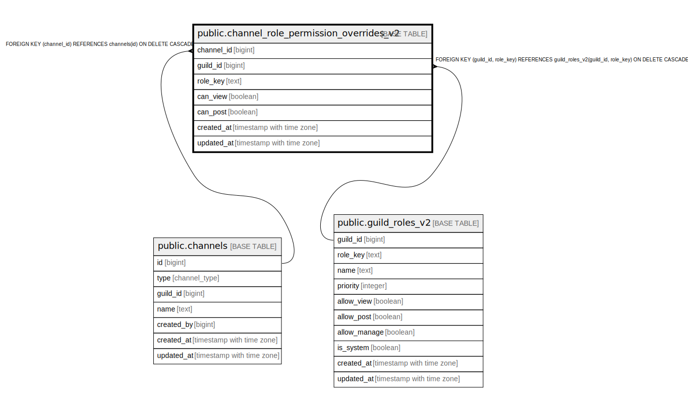

# public.channel_role_permission_overrides_v2

## Description

## Columns

| Name | Type | Default | Nullable | Children | Parents | Comment |
| ---- | ---- | ------- | -------- | -------- | ------- | ------- |
| channel_id | bigint |  | false |  | [public.channels](public.channels.md) |  |
| guild_id | bigint |  | false |  | [public.guild_roles_v2](public.guild_roles_v2.md) |  |
| role_key | text |  | false |  | [public.guild_roles_v2](public.guild_roles_v2.md) |  |
| can_view | boolean |  | true |  |  | NULL はロール既定値を継承、TRUE/FALSE は明示上書き。 |
| can_post | boolean |  | true |  |  | NULL はロール既定値を継承、TRUE/FALSE は明示上書き。 |
| created_at | timestamp with time zone | now() | false |  |  |  |
| updated_at | timestamp with time zone | now() | false |  |  |  |

## Constraints

| Name | Type | Definition |
| ---- | ---- | ---------- |
| chk_channel_role_overrides_v2_role_key_non_empty | CHECK | CHECK ((length(role_key) > 0)) |
| channel_role_permission_overrides_v2_channel_id_fkey | FOREIGN KEY | FOREIGN KEY (channel_id) REFERENCES channels(id) ON DELETE CASCADE |
| channel_role_permission_overrides_v2_guild_id_role_key_fkey | FOREIGN KEY | FOREIGN KEY (guild_id, role_key) REFERENCES guild_roles_v2(guild_id, role_key) ON DELETE CASCADE |
| channel_role_permission_overrides_v2_pkey | PRIMARY KEY | PRIMARY KEY (channel_id, role_key) |

## Indexes

| Name | Definition |
| ---- | ---------- |
| channel_role_permission_overrides_v2_pkey | CREATE UNIQUE INDEX channel_role_permission_overrides_v2_pkey ON public.channel_role_permission_overrides_v2 USING btree (channel_id, role_key) |

## Triggers

| Name | Definition |
| ---- | ---------- |
| trg_enforce_channel_role_overrides_v2_scope | CREATE TRIGGER trg_enforce_channel_role_overrides_v2_scope BEFORE INSERT OR UPDATE ON public.channel_role_permission_overrides_v2 FOR EACH ROW EXECUTE FUNCTION enforce_channel_role_overrides_v2_scope() |

## Relations

---

> Generated by [tbls](https://github.com/k1LoW/tbls)
