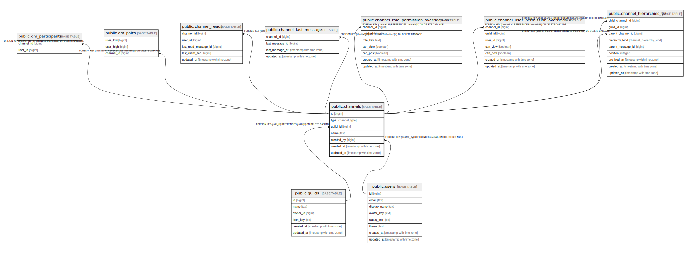

# public.channels

## Description

## Columns

| Name | Type | Default | Nullable | Children | Parents | Comment |
| ---- | ---- | ------- | -------- | -------- | ------- | ------- |
| id | bigint |  | false | [public.dm_participants](public.dm_participants.md) [public.dm_pairs](public.dm_pairs.md) [public.channel_reads](public.channel_reads.md) [public.channel_last_message](public.channel_last_message.md) [public.channel_role_permission_overrides_v2](public.channel_role_permission_overrides_v2.md) [public.channel_user_permission_overrides_v2](public.channel_user_permission_overrides_v2.md) [public.channel_hierarchies_v2](public.channel_hierarchies_v2.md) [public.message_references_v2](public.message_references_v2.md) [public.channel_pins_v2](public.channel_pins_v2.md) [public.message_reactions_v2](public.message_reactions_v2.md) |  |  |
| type | channel_type |  | false |  |  |  |
| guild_id | bigint |  | true |  | [public.guilds](public.guilds.md) |  |
| name | text |  | true |  |  |  |
| created_by | bigint |  | true |  | [public.users](public.users.md) |  |
| created_at | timestamp with time zone | now() | false |  |  |  |
| updated_at | timestamp with time zone | now() | false |  |  |  |

## Constraints

| Name | Type | Definition |
| ---- | ---- | ---------- |
| chk_channels_shape_dm | CHECK | CHECK (((type <> 'dm'::channel_type) OR (guild_id IS NULL))) |
| chk_channels_shape_guild_text | CHECK | CHECK (((type <> 'guild_text'::channel_type) OR ((guild_id IS NOT NULL) AND (name IS NOT NULL)))) |
| channels_created_by_fkey | FOREIGN KEY | FOREIGN KEY (created_by) REFERENCES users(id) ON DELETE SET NULL |
| channels_guild_id_fkey | FOREIGN KEY | FOREIGN KEY (guild_id) REFERENCES guilds(id) ON DELETE CASCADE |
| channels_pkey | PRIMARY KEY | PRIMARY KEY (id) |

## Indexes

| Name | Definition |
| ---- | ---------- |
| channels_pkey | CREATE UNIQUE INDEX channels_pkey ON public.channels USING btree (id) |
| idx_channels_guild | CREATE INDEX idx_channels_guild ON public.channels USING btree (guild_id) WHERE (type = 'guild_text'::channel_type) |

## Relations

---

> Generated by [tbls](https://github.com/k1LoW/tbls)
