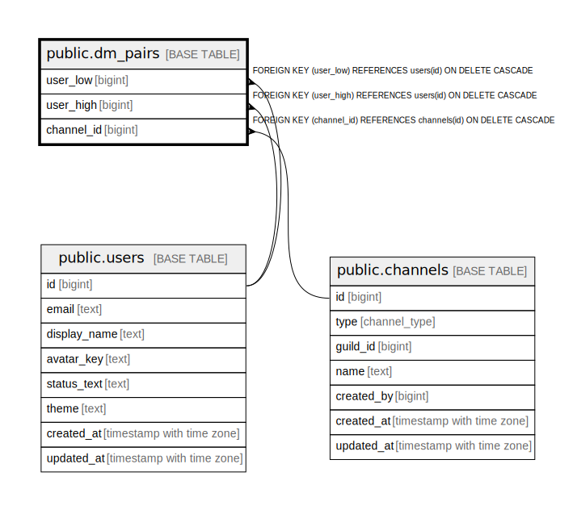

# public.dm_pairs

## Description

## Columns

| Name | Type | Default | Nullable | Children | Parents | Comment |
| ---- | ---- | ------- | -------- | -------- | ------- | ------- |
| user_low | bigint |  | false |  | [public.users](public.users.md) |  |
| user_high | bigint |  | false |  | [public.users](public.users.md) |  |
| channel_id | bigint |  | false |  | [public.channels](public.channels.md) |  |

## Constraints

| Name | Type | Definition |
| ---- | ---- | ---------- |
| chk_dm_pairs_order | CHECK | CHECK ((user_low < user_high)) |
| dm_pairs_channel_id_fkey | FOREIGN KEY | FOREIGN KEY (channel_id) REFERENCES channels(id) ON DELETE CASCADE |
| dm_pairs_pkey | PRIMARY KEY | PRIMARY KEY (user_low, user_high) |
| uq_dm_pairs_channel | UNIQUE | UNIQUE (channel_id) |
| dm_pairs_user_high_fkey | FOREIGN KEY | FOREIGN KEY (user_high) REFERENCES users(id) ON DELETE CASCADE |
| dm_pairs_user_low_fkey | FOREIGN KEY | FOREIGN KEY (user_low) REFERENCES users(id) ON DELETE CASCADE |

## Indexes

| Name | Definition |
| ---- | ---------- |
| dm_pairs_pkey | CREATE UNIQUE INDEX dm_pairs_pkey ON public.dm_pairs USING btree (user_low, user_high) |
| uq_dm_pairs_channel | CREATE UNIQUE INDEX uq_dm_pairs_channel ON public.dm_pairs USING btree (channel_id) |

## Triggers

| Name | Definition |
| ---- | ---------- |
| trg_enforce_dm_pairs_channel_type | CREATE TRIGGER trg_enforce_dm_pairs_channel_type BEFORE INSERT OR UPDATE ON public.dm_pairs FOR EACH ROW EXECUTE FUNCTION enforce_dm_pairs_channel_type() |

## Relations

---

> Generated by [tbls](https://github.com/k1LoW/tbls)
