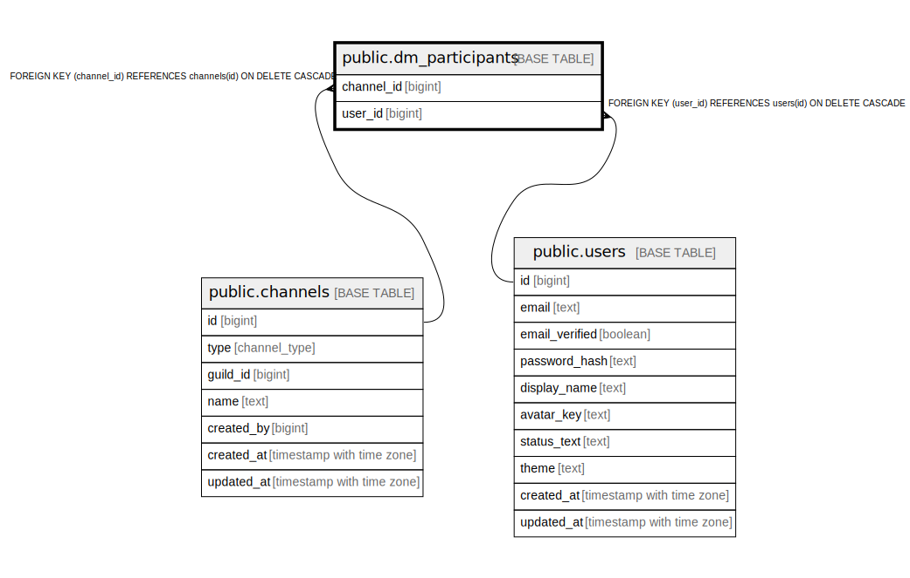

# public.dm_participants

## Description

## Columns

| Name | Type | Default | Nullable | Children | Parents | Comment |
| ---- | ---- | ------- | -------- | -------- | ------- | ------- |
| channel_id | bigint |  | false |  | [public.channels](public.channels.md) |  |
| user_id | bigint |  | false |  | [public.users](public.users.md) |  |

## Constraints

| Name | Type | Definition |
| ---- | ---- | ---------- |
| dm_participants_channel_id_fkey | FOREIGN KEY | FOREIGN KEY (channel_id) REFERENCES channels(id) ON DELETE CASCADE |
| dm_participants_pkey | PRIMARY KEY | PRIMARY KEY (channel_id, user_id) |
| dm_participants_user_id_fkey | FOREIGN KEY | FOREIGN KEY (user_id) REFERENCES users(id) ON DELETE CASCADE |

## Indexes

| Name | Definition |
| ---- | ---------- |
| dm_participants_pkey | CREATE UNIQUE INDEX dm_participants_pkey ON public.dm_participants USING btree (channel_id, user_id) |
| idx_dm_participants_user | CREATE INDEX idx_dm_participants_user ON public.dm_participants USING btree (user_id) |

## Relations

---

> Generated by [tbls](https://github.com/k1LoW/tbls)
