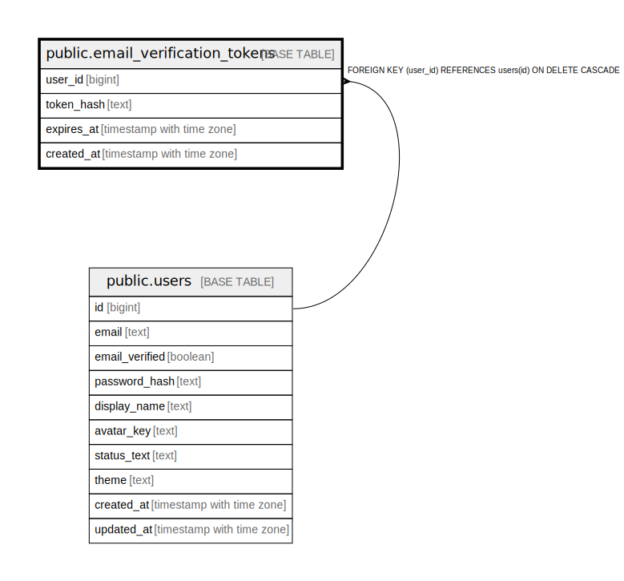

# public.email_verification_tokens

## Description

## Columns

| Name | Type | Default | Nullable | Children | Parents | Comment |
| ---- | ---- | ------- | -------- | -------- | ------- | ------- |
| user_id | bigint |  | false |  | [public.users](public.users.md) |  |
| token_hash | text |  | false |  |  |  |
| expires_at | timestamp with time zone |  | false |  |  |  |
| created_at | timestamp with time zone | now() | false |  |  |  |

## Constraints

| Name | Type | Definition |
| ---- | ---- | ---------- |
| email_verification_tokens_pkey | PRIMARY KEY | PRIMARY KEY (user_id) |
| email_verification_tokens_token_hash_key | UNIQUE | UNIQUE (token_hash) |
| email_verification_tokens_user_id_fkey | FOREIGN KEY | FOREIGN KEY (user_id) REFERENCES users(id) ON DELETE CASCADE |

## Indexes

| Name | Definition |
| ---- | ---------- |
| email_verification_tokens_pkey | CREATE UNIQUE INDEX email_verification_tokens_pkey ON public.email_verification_tokens USING btree (user_id) |
| email_verification_tokens_token_hash_key | CREATE UNIQUE INDEX email_verification_tokens_token_hash_key ON public.email_verification_tokens USING btree (token_hash) |
| idx_email_verification_expires | CREATE INDEX idx_email_verification_expires ON public.email_verification_tokens USING btree (expires_at) |

## Relations

---

> Generated by [tbls](https://github.com/k1LoW/tbls)
