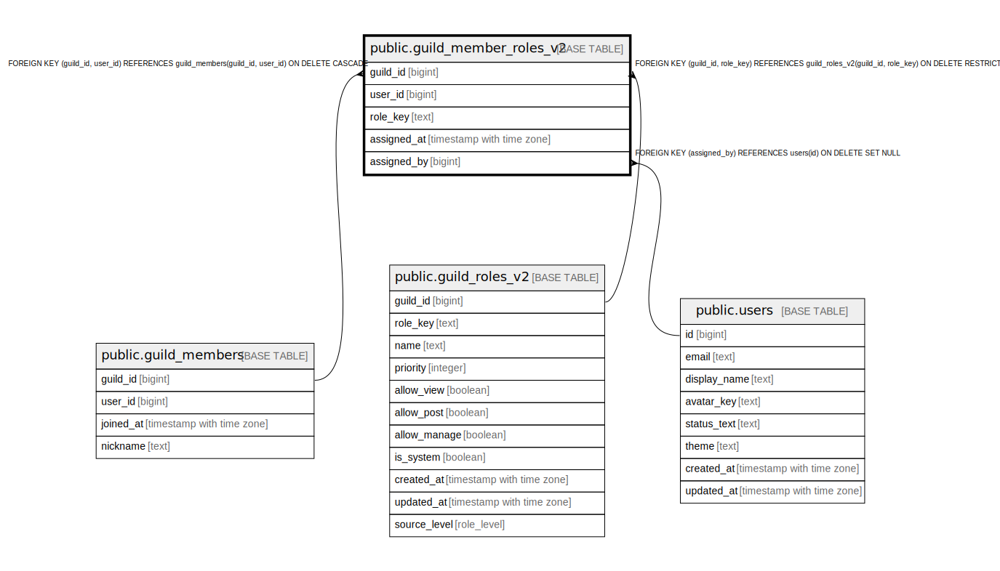

# public.guild_member_roles_v2

## Description

## Columns

| Name | Type | Default | Nullable | Children | Parents | Comment |
| ---- | ---- | ------- | -------- | -------- | ------- | ------- |
| guild_id | bigint |  | false |  | [public.guild_members](public.guild_members.md) [public.guild_roles_v2](public.guild_roles_v2.md) |  |
| user_id | bigint |  | false |  | [public.guild_members](public.guild_members.md) |  |
| role_key | text |  | false |  | [public.guild_roles_v2](public.guild_roles_v2.md) |  |
| assigned_at | timestamp with time zone | now() | false |  |  |  |
| assigned_by | bigint |  | true |  | [public.users](public.users.md) |  |

## Constraints

| Name | Type | Definition |
| ---- | ---- | ---------- |
| guild_member_roles_v2_assigned_by_fkey | FOREIGN KEY | FOREIGN KEY (assigned_by) REFERENCES users(id) ON DELETE SET NULL |
| guild_member_roles_v2_guild_id_user_id_fkey | FOREIGN KEY | FOREIGN KEY (guild_id, user_id) REFERENCES guild_members(guild_id, user_id) ON DELETE CASCADE |
| guild_member_roles_v2_guild_id_role_key_fkey | FOREIGN KEY | FOREIGN KEY (guild_id, role_key) REFERENCES guild_roles_v2(guild_id, role_key) ON DELETE RESTRICT |
| guild_member_roles_v2_pkey | PRIMARY KEY | PRIMARY KEY (guild_id, user_id, role_key) |

## Indexes

| Name | Definition |
| ---- | ---------- |
| guild_member_roles_v2_pkey | CREATE UNIQUE INDEX guild_member_roles_v2_pkey ON public.guild_member_roles_v2 USING btree (guild_id, user_id, role_key) |
| idx_guild_member_roles_v2_user | CREATE INDEX idx_guild_member_roles_v2_user ON public.guild_member_roles_v2 USING btree (user_id, guild_id) |

## Relations

---

> Generated by [tbls](https://github.com/k1LoW/tbls)
