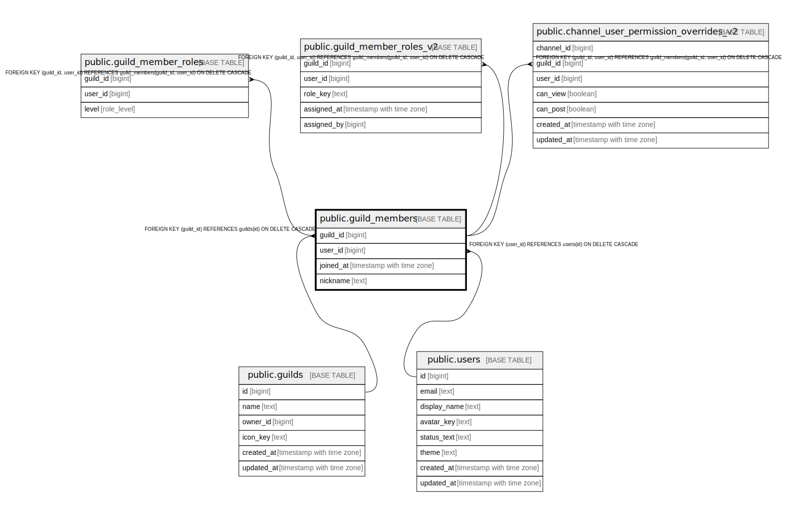

# public.guild_members

## Description

## Columns

| Name | Type | Default | Nullable | Children | Parents | Comment |
| ---- | ---- | ------- | -------- | -------- | ------- | ------- |
| guild_id | bigint |  | false | [public.guild_member_roles](public.guild_member_roles.md) [public.guild_member_roles_v2](public.guild_member_roles_v2.md) [public.channel_user_permission_overrides_v2](public.channel_user_permission_overrides_v2.md) | [public.guilds](public.guilds.md) |  |
| user_id | bigint |  | false | [public.guild_member_roles](public.guild_member_roles.md) [public.guild_member_roles_v2](public.guild_member_roles_v2.md) [public.channel_user_permission_overrides_v2](public.channel_user_permission_overrides_v2.md) | [public.users](public.users.md) |  |
| joined_at | timestamp with time zone | now() | false |  |  |  |
| nickname | text |  | true |  |  |  |

## Constraints

| Name | Type | Definition |
| ---- | ---- | ---------- |
| guild_members_user_id_fkey | FOREIGN KEY | FOREIGN KEY (user_id) REFERENCES users(id) ON DELETE CASCADE |
| guild_members_guild_id_fkey | FOREIGN KEY | FOREIGN KEY (guild_id) REFERENCES guilds(id) ON DELETE CASCADE |
| guild_members_pkey | PRIMARY KEY | PRIMARY KEY (guild_id, user_id) |

## Indexes

| Name | Definition |
| ---- | ---------- |
| guild_members_pkey | CREATE UNIQUE INDEX guild_members_pkey ON public.guild_members USING btree (guild_id, user_id) |
| idx_guild_members_user | CREATE INDEX idx_guild_members_user ON public.guild_members USING btree (user_id) |

## Relations

---

> Generated by [tbls](https://github.com/k1LoW/tbls)
