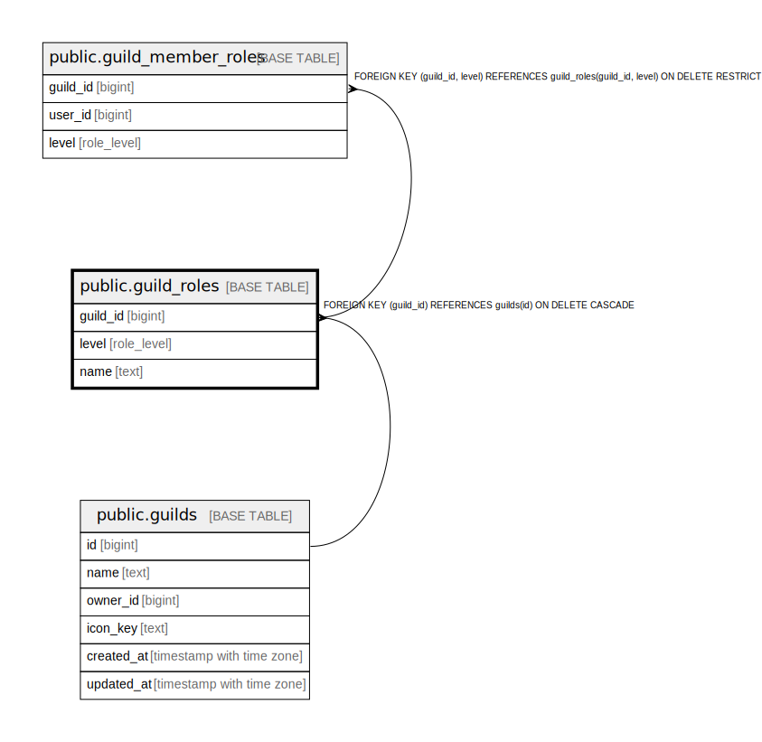

# public.guild_roles

## Description

## Columns

| Name | Type | Default | Nullable | Children | Parents | Comment |
| ---- | ---- | ------- | -------- | -------- | ------- | ------- |
| guild_id | bigint |  | false | [public.guild_member_roles](public.guild_member_roles.md) | [public.guilds](public.guilds.md) |  |
| level | role_level |  | false | [public.guild_member_roles](public.guild_member_roles.md) |  |  |
| name | text |  | false |  |  |  |

## Constraints

| Name | Type | Definition |
| ---- | ---- | ---------- |
| guild_roles_pkey | PRIMARY KEY | PRIMARY KEY (guild_id, level) |
| guild_roles_guild_id_fkey | FOREIGN KEY | FOREIGN KEY (guild_id) REFERENCES guilds(id) ON DELETE CASCADE |

## Indexes

| Name | Definition |
| ---- | ---------- |
| guild_roles_pkey | CREATE UNIQUE INDEX guild_roles_pkey ON public.guild_roles USING btree (guild_id, level) |

## Relations

---

> Generated by [tbls](https://github.com/k1LoW/tbls)
