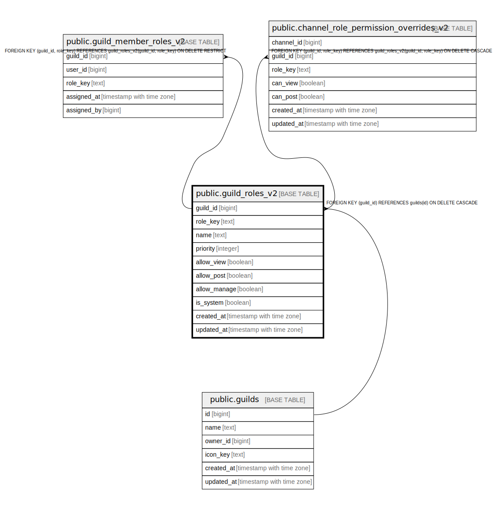

# public.guild_roles_v2

## Description

## Columns

| Name | Type | Default | Nullable | Children | Parents | Comment |
| ---- | ---- | ------- | -------- | -------- | ------- | ------- |
| guild_id | bigint |  | false | [public.guild_member_roles_v2](public.guild_member_roles_v2.md) [public.channel_role_permission_overrides_v2](public.channel_role_permission_overrides_v2.md) | [public.guilds](public.guilds.md) |  |
| role_key | text |  | false | [public.guild_member_roles_v2](public.guild_member_roles_v2.md) [public.channel_role_permission_overrides_v2](public.channel_role_permission_overrides_v2.md) |  |  |
| name | text |  | false |  |  |  |
| priority | integer |  | false |  |  |  |
| allow_view | boolean | true | false |  |  |  |
| allow_post | boolean | true | false |  |  |  |
| allow_manage | boolean | false | false |  |  |  |
| is_system | boolean | false | false |  |  |  |
| created_at | timestamp with time zone | now() | false |  |  |  |
| updated_at | timestamp with time zone | now() | false |  |  |  |
| source_level | role_level |  | true |  |  |  |

## Constraints

| Name | Type | Definition |
| ---- | ---- | ---------- |
| chk_guild_roles_v2_name_non_empty | CHECK | CHECK ((length(name) > 0)) |
| chk_guild_roles_v2_role_key_non_empty | CHECK | CHECK ((length(role_key) > 0)) |
| guild_roles_v2_guild_id_fkey | FOREIGN KEY | FOREIGN KEY (guild_id) REFERENCES guilds(id) ON DELETE CASCADE |
| guild_roles_v2_pkey | PRIMARY KEY | PRIMARY KEY (guild_id, role_key) |

## Indexes

| Name | Definition |
| ---- | ---------- |
| guild_roles_v2_pkey | CREATE UNIQUE INDEX guild_roles_v2_pkey ON public.guild_roles_v2 USING btree (guild_id, role_key) |
| idx_guild_roles_v2_priority | CREATE INDEX idx_guild_roles_v2_priority ON public.guild_roles_v2 USING btree (guild_id, priority DESC, role_key) |

## Relations

---

> Generated by [tbls](https://github.com/k1LoW/tbls)
