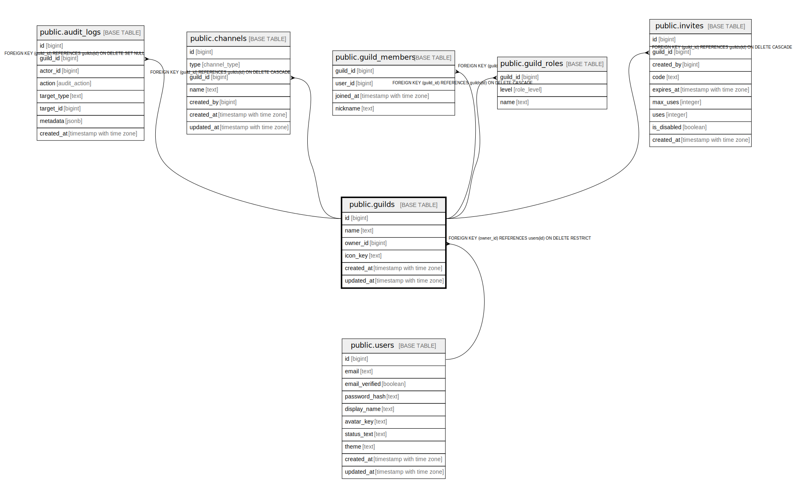

# public.guilds

## Description

## Columns

| Name | Type | Default | Nullable | Children | Parents | Comment |
| ---- | ---- | ------- | -------- | -------- | ------- | ------- |
| id | bigint | nextval('guilds_id_seq'::regclass) | false | [public.guild_members](public.guild_members.md) [public.invites](public.invites.md) [public.channels](public.channels.md) [public.guild_roles](public.guild_roles.md) [public.audit_logs](public.audit_logs.md) [public.guild_roles_v2](public.guild_roles_v2.md) [public.channel_hierarchies_v2](public.channel_hierarchies_v2.md) |  |  |
| name | text |  | false |  |  |  |
| owner_id | bigint |  | false |  | [public.users](public.users.md) |  |
| icon_key | text |  | true |  |  |  |
| created_at | timestamp with time zone | now() | false |  |  |  |
| updated_at | timestamp with time zone | now() | false |  |  |  |

## Constraints

| Name | Type | Definition |
| ---- | ---- | ---------- |
| chk_guilds_name_not_blank | CHECK | CHECK ((btrim(name) <> ''::text)) |
| guilds_owner_id_fkey | FOREIGN KEY | FOREIGN KEY (owner_id) REFERENCES users(id) ON DELETE RESTRICT |
| guilds_pkey | PRIMARY KEY | PRIMARY KEY (id) |

## Indexes

| Name | Definition |
| ---- | ---------- |
| guilds_pkey | CREATE UNIQUE INDEX guilds_pkey ON public.guilds USING btree (id) |

## Relations

---

> Generated by [tbls](https://github.com/k1LoW/tbls)
