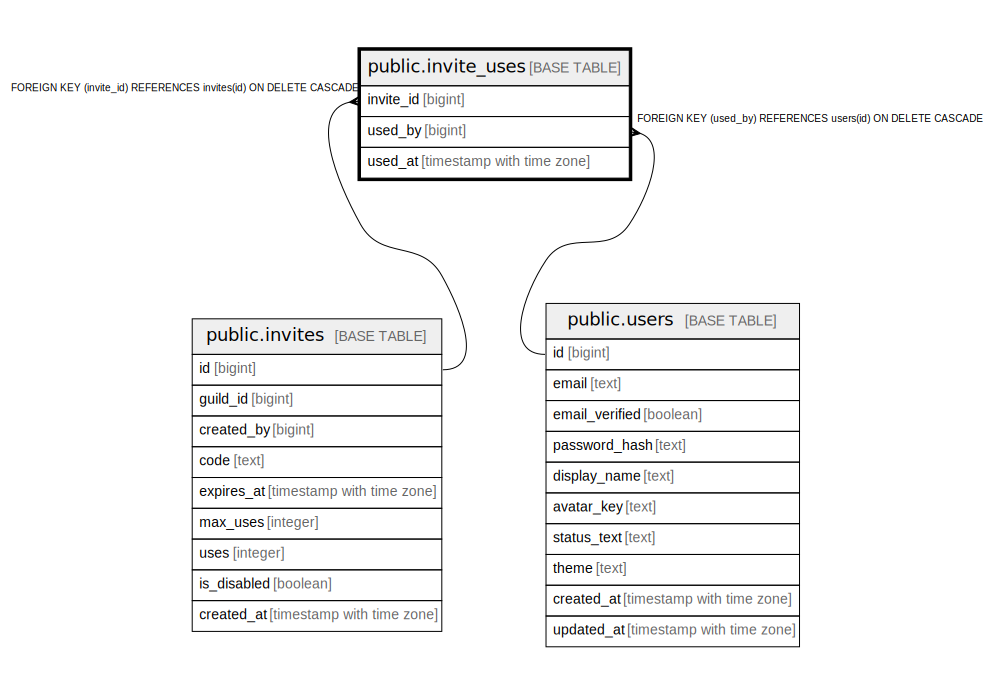

# public.invite_uses

## Description

## Columns

| Name | Type | Default | Nullable | Children | Parents | Comment |
| ---- | ---- | ------- | -------- | -------- | ------- | ------- |
| invite_id | bigint |  | false |  | [public.invites](public.invites.md) |  |
| used_by | bigint |  | false |  | [public.users](public.users.md) |  |
| used_at | timestamp with time zone | now() | false |  |  |  |

## Constraints

| Name | Type | Definition |
| ---- | ---- | ---------- |
| invite_uses_used_by_fkey | FOREIGN KEY | FOREIGN KEY (used_by) REFERENCES users(id) ON DELETE CASCADE |
| invite_uses_invite_id_fkey | FOREIGN KEY | FOREIGN KEY (invite_id) REFERENCES invites(id) ON DELETE CASCADE |
| invite_uses_pkey | PRIMARY KEY | PRIMARY KEY (invite_id, used_by) |

## Indexes

| Name | Definition |
| ---- | ---------- |
| invite_uses_pkey | CREATE UNIQUE INDEX invite_uses_pkey ON public.invite_uses USING btree (invite_id, used_by) |

## Relations

---

> Generated by [tbls](https://github.com/k1LoW/tbls)
