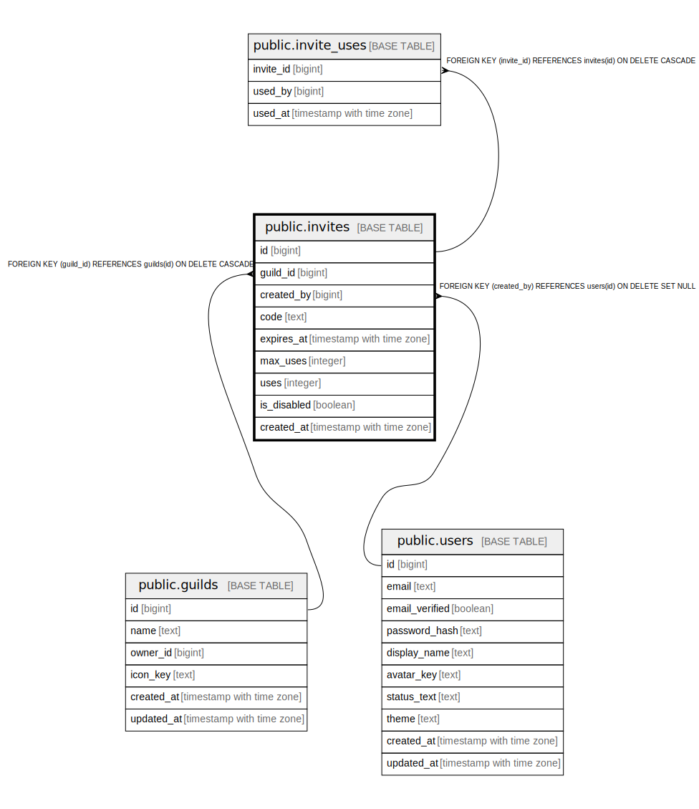

# public.invites

## Description

## Columns

| Name | Type | Default | Nullable | Children | Parents | Comment |
| ---- | ---- | ------- | -------- | -------- | ------- | ------- |
| id | bigint |  | false | [public.invite_uses](public.invite_uses.md) |  |  |
| guild_id | bigint |  | false |  | [public.guilds](public.guilds.md) |  |
| channel_id | bigint |  | true |  | [public.channels](public.channels.md) |  |
| created_by | bigint |  | true |  | [public.users](public.users.md) |  |
| code | text |  | false |  |  |  |
| expires_at | timestamp with time zone |  | true |  |  |  |
| max_uses | integer |  | true |  |  |  |
| uses | integer | 0 | false |  |  |  |
| is_disabled | boolean | false | false |  |  |  |
| created_at | timestamp with time zone | now() | false |  |  |  |

## Constraints

| Name | Type | Definition |
| ---- | ---- | ---------- |
| chk_invites_max_uses_positive | CHECK | CHECK (((max_uses IS NULL) OR (max_uses > 0))) |
| chk_invites_uses_lte_max | CHECK | CHECK (((max_uses IS NULL) OR (uses <= max_uses))) |
| chk_invites_uses_non_negative | CHECK | CHECK ((uses >= 0)) |
| invites_created_by_fkey | FOREIGN KEY | FOREIGN KEY (created_by) REFERENCES users(id) ON DELETE SET NULL |
| invites_channel_id_fkey | FOREIGN KEY | FOREIGN KEY (channel_id) REFERENCES channels(id) ON DELETE SET NULL |
| invites_guild_id_fkey | FOREIGN KEY | FOREIGN KEY (guild_id) REFERENCES guilds(id) ON DELETE CASCADE |
| invites_pkey | PRIMARY KEY | PRIMARY KEY (id) |
| invites_code_key | UNIQUE | UNIQUE (code) |

## Indexes

| Name | Definition |
| ---- | ---------- |
| invites_pkey | CREATE UNIQUE INDEX invites_pkey ON public.invites USING btree (id) |
| invites_code_key | CREATE UNIQUE INDEX invites_code_key ON public.invites USING btree (code) |
| idx_invites_guild_channel | CREATE INDEX idx_invites_guild_channel ON public.invites USING btree (guild_id, channel_id) WHERE (channel_id IS NOT NULL) |
| idx_invites_guild | CREATE INDEX idx_invites_guild ON public.invites USING btree (guild_id) |
| idx_invites_expires | CREATE INDEX idx_invites_expires ON public.invites USING btree (expires_at) WHERE (expires_at IS NOT NULL) |

## Relations

---

> Generated by [tbls](https://github.com/k1LoW/tbls)
