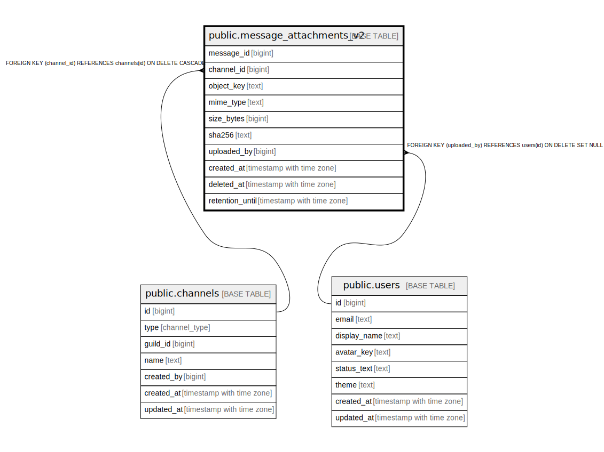

# public.message_attachments_v2

## Description

## Columns

| Name | Type | Default | Nullable | Children | Parents | Comment |
| ---- | ---- | ------- | -------- | -------- | ------- | ------- |
| message_id | bigint |  | false |  |  |  |
| channel_id | bigint |  | false |  | [public.channels](public.channels.md) |  |
| object_key | text |  | false |  |  |  |
| mime_type | text |  | false |  |  |  |
| size_bytes | bigint |  | false |  |  |  |
| sha256 | text |  | false |  |  |  |
| uploaded_by | bigint |  | true |  | [public.users](public.users.md) |  |
| created_at | timestamp with time zone | now() | false |  |  |  |
| deleted_at | timestamp with time zone |  | true |  |  |  |
| retention_until | timestamp with time zone |  | true |  |  |  |

## Constraints

| Name | Type | Definition |
| ---- | ---- | ---------- |
| chk_msg_att_v2_deleted_at_order | CHECK | CHECK (((deleted_at IS NULL) OR (deleted_at >= created_at))) |
| chk_msg_att_v2_mime_non_empty | CHECK | CHECK ((length(mime_type) > 0)) |
| chk_msg_att_v2_object_key_non_empty | CHECK | CHECK ((length(object_key) > 0)) |
| chk_msg_att_v2_object_key_prefix | CHECK | CHECK ((object_key ~~ 'v0/tenant/%'::text)) |
| chk_msg_att_v2_retention_order | CHECK | CHECK (((retention_until IS NULL) OR (retention_until >= created_at))) |
| chk_msg_att_v2_sha256_format | CHECK | CHECK ((sha256 ~ '^[0-9A-Fa-f]{64}$'::text)) |
| chk_msg_att_v2_size_non_negative | CHECK | CHECK ((size_bytes >= 0)) |
| message_attachments_v2_uploaded_by_fkey | FOREIGN KEY | FOREIGN KEY (uploaded_by) REFERENCES users(id) ON DELETE SET NULL |
| message_attachments_v2_channel_id_fkey | FOREIGN KEY | FOREIGN KEY (channel_id) REFERENCES channels(id) ON DELETE CASCADE |
| message_attachments_v2_pkey | PRIMARY KEY | PRIMARY KEY (message_id, object_key) |

## Indexes

| Name | Definition |
| ---- | ---------- |
| message_attachments_v2_pkey | CREATE UNIQUE INDEX message_attachments_v2_pkey ON public.message_attachments_v2 USING btree (message_id, object_key) |
| uq_msg_att_v2_object_key | CREATE UNIQUE INDEX uq_msg_att_v2_object_key ON public.message_attachments_v2 USING btree (object_key) |
| idx_msg_att_v2_message_created | CREATE INDEX idx_msg_att_v2_message_created ON public.message_attachments_v2 USING btree (message_id, created_at DESC, object_key) |
| idx_msg_att_v2_retention_active | CREATE INDEX idx_msg_att_v2_retention_active ON public.message_attachments_v2 USING btree (retention_until) WHERE ((retention_until IS NOT NULL) AND (deleted_at IS NULL)) |
| idx_msg_att_v2_deleted_at | CREATE INDEX idx_msg_att_v2_deleted_at ON public.message_attachments_v2 USING btree (deleted_at) WHERE (deleted_at IS NOT NULL) |

## Relations

---

> Generated by [tbls](https://github.com/k1LoW/tbls)
