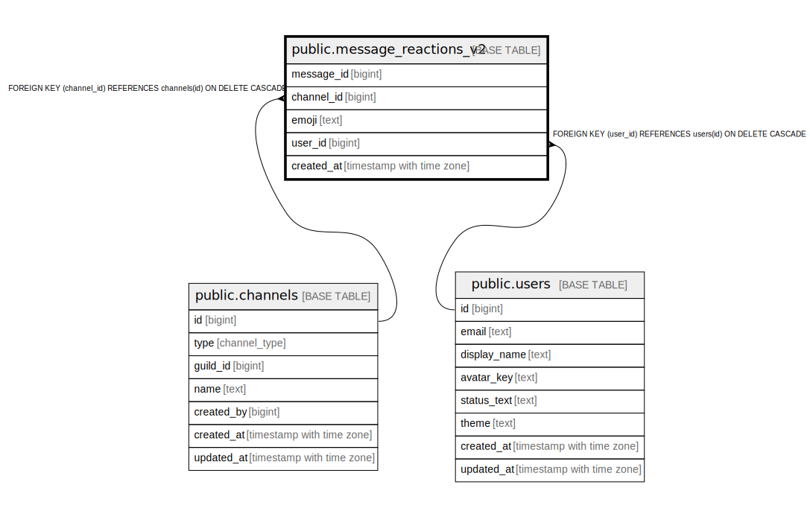

# public.message_reactions_v2

## Description

## Columns

| Name | Type | Default | Nullable | Children | Parents | Comment |
| ---- | ---- | ------- | -------- | -------- | ------- | ------- |
| message_id | bigint |  | false |  |  |  |
| channel_id | bigint |  | false |  | [public.channels](public.channels.md) |  |
| emoji | text |  | false |  |  |  |
| user_id | bigint |  | false |  | [public.users](public.users.md) |  |
| created_at | timestamp with time zone | now() | false |  |  |  |

## Constraints

| Name | Type | Definition |
| ---- | ---- | ---------- |
| chk_msg_reactions_v2_emoji_len | CHECK | CHECK ((length(emoji) <= 128)) |
| chk_msg_reactions_v2_emoji_non_empty | CHECK | CHECK ((length(emoji) > 0)) |
| message_reactions_v2_user_id_fkey | FOREIGN KEY | FOREIGN KEY (user_id) REFERENCES users(id) ON DELETE CASCADE |
| message_reactions_v2_channel_id_fkey | FOREIGN KEY | FOREIGN KEY (channel_id) REFERENCES channels(id) ON DELETE CASCADE |
| message_reactions_v2_pkey | PRIMARY KEY | PRIMARY KEY (message_id, emoji, user_id) |

## Indexes

| Name | Definition |
| ---- | ---------- |
| message_reactions_v2_pkey | CREATE UNIQUE INDEX message_reactions_v2_pkey ON public.message_reactions_v2 USING btree (message_id, emoji, user_id) |
| idx_msg_reactions_v2_msg_emoji_created | CREATE INDEX idx_msg_reactions_v2_msg_emoji_created ON public.message_reactions_v2 USING btree (message_id, emoji, created_at DESC) |

## Relations

---

> Generated by [tbls](https://github.com/k1LoW/tbls)
