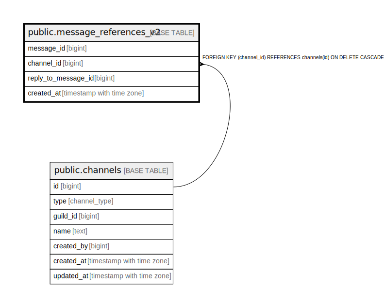

# public.message_references_v2

## Description

## Columns

| Name | Type | Default | Nullable | Children | Parents | Comment |
| ---- | ---- | ------- | -------- | -------- | ------- | ------- |
| message_id | bigint |  | false |  |  |  |
| channel_id | bigint |  | false |  | [public.channels](public.channels.md) |  |
| reply_to_message_id | bigint |  | false |  |  | Scylla SoR上の参照先message_id。削除済み参照先のトゥームストーン表示整合のためFKを張らない。 |
| created_at | timestamp with time zone | now() | false |  |  |  |

## Constraints

| Name | Type | Definition |
| ---- | ---- | ---------- |
| chk_msg_refs_v2_not_self | CHECK | CHECK ((message_id <> reply_to_message_id)) |
| message_references_v2_channel_id_fkey | FOREIGN KEY | FOREIGN KEY (channel_id) REFERENCES channels(id) ON DELETE CASCADE |
| message_references_v2_pkey | PRIMARY KEY | PRIMARY KEY (message_id) |

## Indexes

| Name | Definition |
| ---- | ---------- |
| message_references_v2_pkey | CREATE UNIQUE INDEX message_references_v2_pkey ON public.message_references_v2 USING btree (message_id) |
| idx_msg_refs_v2_channel_reply | CREATE INDEX idx_msg_refs_v2_channel_reply ON public.message_references_v2 USING btree (channel_id, reply_to_message_id, message_id DESC) |

## Relations

---

> Generated by [tbls](https://github.com/k1LoW/tbls)
