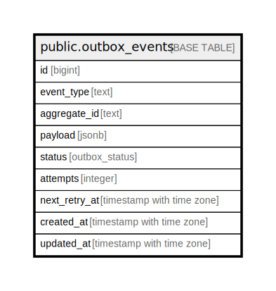

# public.outbox_events

## Description

## Columns

| Name | Type | Default | Nullable | Children | Parents | Comment |
| ---- | ---- | ------- | -------- | -------- | ------- | ------- |
| id | bigint |  | false |  |  |  |
| event_type | text |  | false |  |  |  |
| aggregate_id | text |  | false |  |  |  |
| payload | jsonb |  | false |  |  |  |
| status | outbox_status | 'PENDING'::outbox_status | false |  |  |  |
| attempts | integer | 0 | false |  |  |  |
| next_retry_at | timestamp with time zone |  | true |  |  |  |
| created_at | timestamp with time zone | now() | false |  |  |  |
| updated_at | timestamp with time zone | now() | false |  |  |  |

## Constraints

| Name | Type | Definition |
| ---- | ---- | ---------- |
| chk_outbox_attempts_non_negative | CHECK | CHECK ((attempts >= 0)) |
| outbox_events_pkey | PRIMARY KEY | PRIMARY KEY (id) |

## Indexes

| Name | Definition |
| ---- | ---------- |
| outbox_events_pkey | CREATE UNIQUE INDEX outbox_events_pkey ON public.outbox_events USING btree (id) |
| idx_outbox_pending | CREATE INDEX idx_outbox_pending ON public.outbox_events USING btree (status, next_retry_at, created_at) |
| idx_outbox_failed | CREATE INDEX idx_outbox_failed ON public.outbox_events USING btree (status, created_at DESC) WHERE (status = 'FAILED'::outbox_status) |

## Relations

---

> Generated by [tbls](https://github.com/k1LoW/tbls)
