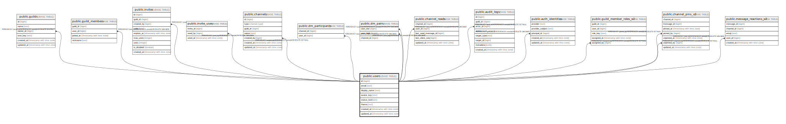

# public.users

## Description

## Columns

| Name | Type | Default | Nullable | Children | Parents | Comment |
| ---- | ---- | ------- | -------- | -------- | ------- | ------- |
| id | bigint | nextval('users_id_seq'::regclass) | false | [public.guilds](public.guilds.md) [public.guild_members](public.guild_members.md) [public.invites](public.invites.md) [public.invite_uses](public.invite_uses.md) [public.channels](public.channels.md) [public.dm_participants](public.dm_participants.md) [public.dm_pairs](public.dm_pairs.md) [public.channel_reads](public.channel_reads.md) [public.audit_logs](public.audit_logs.md) [public.auth_identities](public.auth_identities.md) [public.guild_member_roles_v2](public.guild_member_roles_v2.md) [public.channel_pins_v2](public.channel_pins_v2.md) [public.message_reactions_v2](public.message_reactions_v2.md) [public.message_attachments_v2](public.message_attachments_v2.md) |  |  |
| email | text |  | false |  |  |  |
| display_name | text |  | false |  |  |  |
| avatar_key | text |  | true |  |  |  |
| status_text | text |  | true |  |  |  |
| theme | text | 'dark'::text | false |  |  |  |
| created_at | timestamp with time zone | now() | false |  |  |  |
| updated_at | timestamp with time zone | now() | false |  |  |  |
| banner_key | text |  | true |  |  |  |

## Constraints

| Name | Type | Definition |
| ---- | ---- | ---------- |
| chk_users_theme | CHECK | CHECK ((theme = ANY (ARRAY['dark'::text, 'light'::text]))) |
| users_pkey | PRIMARY KEY | PRIMARY KEY (id) |

## Indexes

| Name | Definition |
| ---- | ---------- |
| users_pkey | CREATE UNIQUE INDEX users_pkey ON public.users USING btree (id) |
| uq_users_email_lower | CREATE UNIQUE INDEX uq_users_email_lower ON public.users USING btree (lower(email)) |

## Triggers

| Name | Definition |
| ---- | ---------- |
| trg_users_set_updated_at | CREATE TRIGGER trg_users_set_updated_at BEFORE UPDATE ON public.users FOR EACH ROW EXECUTE FUNCTION set_users_updated_at() |

## Relations

---

> Generated by [tbls](https://github.com/k1LoW/tbls)
